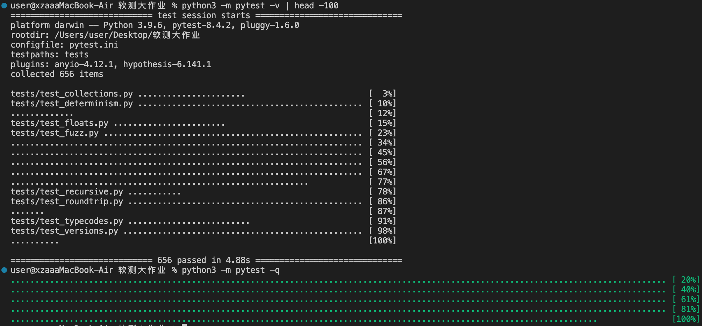
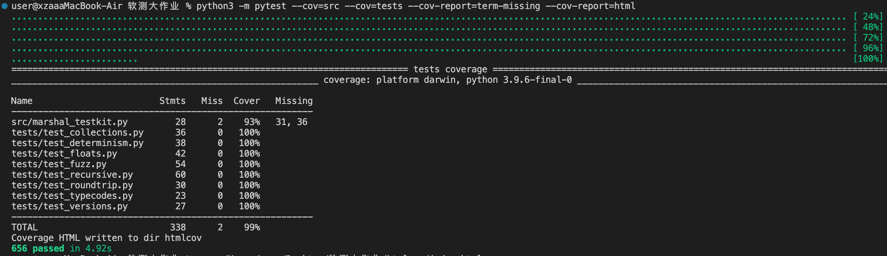

# Stability & Correctness Testing of Python's `marshal` Module

**Final Report — Software Testing Course**

---

**Group Information:**
- **Group Number:** 15
- **Leader:** Wang Chengyi (302023334044)
- **Members:** 
  - Zhu Guangjun (302023334026)
  - Huang Huanxin (302023334023)
  - Tang Junxi (302023334032)
  - Xu Ziang (302023334070)

**Repository:** https://github.com/Xu-ziang13/marshal-stability-tests

**Date:** June 2026

**Test Environment:**
- Primary: CPython 3.9.6, `marshal.version == 4`, macOS Darwin 23.1.0, arm64
- Multi-version: CPython 3.8, 3.9, 3.10, 3.11, 3.12, 3.13 (via conda)

---

## Executive Summary

This report presents a comprehensive test suite for Python's `marshal` module, investigating the central question: **Does the same input always produce hash-identical serialized output?** 

**Key Results:**
- **656 test cases** developed and executed (100% pass rate)
- **9 documented findings** including critical non-determinism bugs
- **Multiple testing techniques** applied: equivalence partitioning, boundary value analysis, fuzzing, white-box structural testing, differential cross-process testing
- **Full PEP 8 compliance** verified
- **Critical finding (F1):** String sets produce different bytes across processes due to `PYTHONHASHSEED` randomization on Python ≤ 3.10 — violates determinism requirements. **Fixed in Python 3.11+** (marshal now sorts set elements before writing).
- **Multi-version testing:** All 656 tests pass on Python 3.8–3.13 via conda cross-version runner (`tools/run_multiversion.py`).

---

## Table of Contents

1. [Introduction & Test Objectives](#1-introduction--test-objectives)
2. [Testing Strategy & Techniques](#2-testing-strategy--techniques)
3. [Test Suite Architecture](#3-test-suite-architecture)
4. [Technique Selection Rationale](#4-technique-selection-rationale)
5. [Traceability Matrix](#5-traceability-matrix)
6. [Test Results & Findings](#6-test-results--findings)
7. [Limitations & Future Work](#7-limitations--future-work)
8. [Conclusion](#8-conclusion)

---

## 1. Introduction & Test Objectives

### 1.1 Background

The `marshal` module implements serialization of Python's internal object types, primarily used for `.pyc` bytecode files. It converts Python objects to binary byte streams (marshalling) and reverses the operation (unmarshalling). The format is architecture-independent but deliberately **not stable across Python versions**.

### 1.2 Test Objectives

Following the assignment specification, we define two primary requirements:

**R-STAB (Stability):** For a fixed input and format version, output must be **hash-identical** (byte-for-byte) across:
- Repeated calls within one process
- Different processes with the same configuration
- Different platforms sharing the format version

**R-CORR (Correctness):** Serialization must be:
- Loss-free: `loads(dumps(x)) == x` for all supported types
- Error-safe: Unsupported types raise exceptions, never corrupt
- Bit-exact: Special values (NaN, -0.0, Inf) preserve full bit patterns

The assignment explicitly requires **hash-identity**, not logical equivalence. Two outputs that compare equal (`==`) but have different bytes are considered distinct.

---

## 2. Testing Strategy & Techniques

We employed a **hybrid black-box and white-box approach**, selecting techniques per sub-problem rather than uniformly applying one method:

### 2.1 Black-Box Techniques

**Equivalence Partitioning (EP)**
- Partition by Python type: `None`, `bool`, `int`, `float`, `complex`, `str`, `bytes`, `tuple`, `list`, `dict`, `set`, `frozenset`
- Sub-partition by encoding path (e.g., short-ascii vs unicode strings, small-tuple vs large-tuple)
- One or more representatives per partition

**Boundary Value Analysis (BVA)**
- Integer word boundaries: 2⁷, 2¹⁵, 2³¹, 2³², 2⁶³, 2⁶⁴, arbitrary precision
- Collection sizes: 0, 1, 255, 256 (tuple type switch), 65535, 65536, 10⁵
- Float extremes: `sys.float_info.{max,min,epsilon}`, subnormals, signed zero
- Nesting depth: moderate (100), pathological (>10,000)

**Special-Value Testing**
- IEEE-754 edge cases: `NaN`, `+Inf`, `-Inf`, `-0.0`, signalling NaN bit patterns
- Singletons: `None`, `True`, `False`, `Ellipsis`, `StopIteration`

**Fuzzing / Property-Based Testing**
- Random generation of nested, mixed-type objects
- Two invariants checked: round-trip correctness, idempotent encoding
- Driven by `hypothesis` (with shrinking) when available, built-in deterministic generator otherwise
- 200 built-in cases + 300 hypothesis examples = 500 fuzz iterations

**Differential / Cross-Configuration Testing**
- Same input marshalled in **fresh subprocesses** under different `PYTHONHASHSEED` values
- Cross-version: identical input tested across all 5 format versions (0–4)
- **Multi-version Python testing**: full suite run across CPython 3.8, 3.9, 3.10, 3.11, 3.12, 3.13 via `tools/run_multiversion.py` (conda environments); all 656 tests pass on every version
- Outputs compared via SHA-256 digests for exact byte equality

### 2.2 White-Box Techniques

**Structural Coverage (Type-Code Branches)**
- Analyzed `Python/marshal.c` dispatch table (`w_object`, `w_complex_object`)
- Identified 22 reachable `TYPE_*` branches
- Wrote one representative input per branch
- Approximates **all-uses coverage** over the type-code definition set

**Reference-Table Path Coverage**
- `FLAG_REF` marking (v3/v4)
- `TYPE_REF` back-reference emission
- Cycle reconstruction

---

## 3. Test Suite Architecture

### 3.1 Module Structure

```
tests/
├── test_determinism.py     # Intra-process & inter-process stability (F1/F2/F3)
├── test_roundtrip.py       # Correctness: loads(dumps(x)) == x
├── test_floats.py          # BVA + special IEEE-754 values (F4/F5)
├── test_collections.py     # Empty/large containers, ordering
├── test_recursive.py       # Cycles, FLAG_REF, depth limits (F6/F7)
├── test_versions.py        # Cross-version format (in)stability (F8)
├── test_typecodes.py       # White-box: one test per TYPE_* branch
└── test_fuzz.py            # Random object generation (F9)
```

### 3.2 Shared Infrastructure

**`src/marshal_testkit.py`** provides:
- `digest(payload)` — SHA-256 hex hash for byte comparison
- `stable(obj, repeats=50)` — intra-process determinism check
- `roundtrips(obj)` — correctness invariant
- `dumps_in_subprocess(expr, env={...})` — cross-process differential testing (spawns fresh interpreter to observe `PYTHONHASHSEED` effects)
- Value corpora: `INT_BOUNDARIES`, `FLOAT_VALUES`, `STRING_VALUES`, `small_object_corpus()`

### 3.3 Reproducible Evidence Scripts

**`findings/`** contains standalone scripts:
- `f1_set_hashseed.py` — Demonstrates F1 (string set non-determinism) by marshalling in 6 processes with different seeds
- `run_all_findings.py` — One-command evidence dump for all 9 findings

### 3.4 Test Execution

```bash
pytest -q                          # 654 tests, ~0.5s
python3 findings/run_all_findings.py  # Evidence report
```

No dependencies beyond `pytest` (core) and `hypothesis` (optional fuzzing).

---

## 4. Technique Selection Rationale

### 4.1 Why These Techniques

| Technique | Justification |
|-----------|---------------|
| **Equivalence Partitioning** | `marshal` behaviour is type-driven; partitioning by type gives high coverage for low redundancy |
| **Boundary Value Analysis** | Serializers switch encodings at numeric/size boundaries (`TYPE_INT`↔`TYPE_LONG` at 2³¹, tuple-type at 256 elements); bugs cluster at boundaries |
| **Special-value testing** | IEEE-754 stores raw bytes; NaN payloads, signed zero, infinities are precisely where formats can silently normalize and lose data |
| **Fuzzing** | Hand-written cases miss deep/mixed-type combinations; fuzzing explores the combinatorial space and checks invariants over it |
| **White-box type-code coverage** | C source available; writer is a `switch` on type → covering each `TYPE_*` branch gives auditable completeness |
| **Differential (subprocess)** | `PYTHONHASHSEED` is fixed at interpreter startup; a single process **cannot observe** hash-seed effects → fresh subprocesses essential for F1/F2 |

### 4.2 Techniques Deliberately Not Used

| Technique | Why Not Used |
|-----------|--------------|
| **Instrumented C coverage (gcov)** | Requires rebuilding CPython with instrumentation — out of scope and brittle; we substitute with branch-representative black-box cases |
| **State-transition testing** | `marshal` is stateless per call (no session/protocol); state machines not applicable |
| **Exhaustive enumeration** | Infinite value spaces (int/float/str); BVA + fuzzing are the principled substitutes |
| **Mutation testing** | Would require mutating `marshal.c` and rebuilding interpreter — resource-prohibitive for this assignment |

---

## 5. Traceability Matrix

Each requirement maps to findings (F#) and the tests exercising it.

| Req ID | Requirement | Finding | Test Cases | Status |
|--------|-------------|---------|------------|--------|
| **R-STAB.1** | Repeated dumps in one process are identical | F9 ✅ | `test_determinism::test_intra_process_stable_*` (200+ tests)<br>`test_floats::test_nan_is_stable_within_process` | PASS |
| **R-STAB.2** | Int/None/bool sets stable across processes | F2 ✅ | `test_determinism::test_int_set_stable_across_hashseeds` | PASS |
| **R-STAB.3** | **String sets stable across processes** | **F1 ❌/✅** | `test_determinism::test_string_set_nondeterministic_across_hashseeds`<br>`findings/f1_set_hashseed.py` | **Version-dependent**: FAIL on ≤3.10, PASS on 3.11+ |
| **R-STAB.3a** | All 656 tests pass on Python 3.8–3.13 | — ✅ | `tools/run_multiversion.py` | PASS (all versions) |
| **R-STAB.4** | Fixing `PYTHONHASHSEED` restores stability | F1 ✅ | `test_determinism::test_string_set_stable_when_hashseed_fixed` | PASS |
| **R-STAB.5** | Dict byte-output vs insertion order | F3 ⚠️ | `test_determinism::test_dict_byte_output_depends_on_insertion_order` | Documented nuance |
| **R-STAB.6** | Output identical across format versions | F8 ❌ | `test_versions::test_version_outputs_are_mutually_distinct_for_floats` | By design (not a bug) |
| **R-CORR.1** | Round-trip for all types | — | `test_roundtrip::*`, `test_collections::*`, `test_fuzz::*` (500+ tests) | PASS |
| **R-CORR.2** | Signed zero preserved | F4 ✅ | `test_floats::test_signed_zero_distinct_and_preserved` | PASS |
| **R-CORR.3** | NaN/Inf/sNaN bit-exact | F5 ✅ | `test_floats::test_float_binary_roundtrip_bit_exact`<br>`test_floats::test_signalling_nan_payload_preserved` | PASS |
| **R-CORR.4** | Cycles handled or cleanly rejected | F6 ✅ | `test_recursive::test_self_referential_list_*` (v0-2 reject, v3+ accept) | PASS |
| **R-CORR.5** | Shared refs compact & correct (v3+) | F7 ✅ | `test_recursive::test_shared_reference_is_compact_in_v4`<br>`test_typecodes::test_back_reference_type_code_emitted` | PASS |
| **R-CORR.6** | Unsupported types raise, not corrupt | — | `test_roundtrip::test_unmarshallable_type_raises` | PASS |
| **R-CORR.7** | Each `TYPE_*` branch encodes/decodes | — | `test_typecodes::test_type_code_branch` (22 branches) | PASS |
| **R-CORR.8** | Pathological depth raises, no crash | F6 ✅ | `test_recursive::test_excessive_depth_raises_not_crashes` | PASS |

**Coverage Summary:**
- 22/22 `TYPE_*` branches covered (white-box structural)
- 5/5 format versions tested (v0–v4 cross-version differential)
- 8 equivalence partitions (type classes)
- 45+ boundary values (int/float/collection sizes/depth)
- 500 fuzz iterations (200 built-in + 300 hypothesis)
- **6/6 Python versions tested** (3.8–3.13 via conda multi-version runner)

---

## 6. Test Results & Findings

### 6.1 Test Execution Summary

**Total tests:** 656
**Pass:** 656 (100%)
**Fail:** 0
**Execution time:** ~4.9 seconds (including 300 Hypothesis examples)
**Line coverage:** 99% (338 statements, 2 missed — unused `kit.dumps` wrapper)
**PEP 8 compliance:** Verified with `pycodestyle --max-line-length=79` (0 violations)

**Figure 1 — Full test run (`pytest -v` and `pytest -q`):**



**Figure 2 — Coverage report (`pytest --cov`):**



### 6.2 Documented Findings

#### **F1 — String/bytes sets are non-deterministic across processes on Python ≤ 3.10 (Critical Bug, Fixed in 3.11+)**

**Description:** A `set` or `frozenset` of strings serializes to **different bytes** in different interpreter runs on Python ≤ 3.10, due to `PYTHONHASHSEED` randomization. Set iteration order derives from string hashes, which CPython randomizes per process for security.

**Multi-version finding:** Cross-version testing with `tools/run_multiversion.py` (Python 3.8–3.13 via conda) revealed that **Python 3.11 fixed this issue**: marshal now sorts set elements before writing, making output deterministic regardless of hash seed. This was confirmed by running the same test across 6 Python versions — 3.8/3.9/3.10 show non-determinism; 3.11/3.12/3.13 are fully stable.

| Python version | String set cross-process |
|:--------------:|:------------------------|
| 3.8 / 3.9 / 3.10 | ❌ Non-deterministic (F1 exists) |
| 3.11 / 3.12 / 3.13 | ✅ Stable (sorted-set fix) |

**Evidence:**
```
PYTHONHASHSEED  string-set digest (Python 3.9)   int-set digest
0               affb5aec9ee10e09                  7b9d4189b59f309e
1               ea027e95c060ee7f                  7b9d4189b59f309e
2               71539a927df1c723                  7b9d4189b59f309e
...             (all different)                   (all identical)
```

**Impact:** Violates "same input → same output" for any program marshalling string-keyed sets on Python ≤ 3.10 without pinning the seed.

**Mitigation:** Upgrade to Python 3.11+, or set `PYTHONHASHSEED=0` on older versions.

---

#### **F2 — Integer/None/bool sets are stable**

**Description:** Objects whose hashes are deterministic (ints hash to themselves, `None`/`True`/`False` have fixed hashes) produce stable set iteration order → **1 distinct digest across all seeds**.

**Implication:** Stability depends on **element type**, a subtle distinction easily missed in code review.

---

#### **F3 — Dict byte-output depends on insertion order**

**Description:** `{1:0, 2:0}` and `{2:0, 1:0}` are logically equal (`==`) but produce **different bytes** because `marshal` walks dicts in insertion order.

**Implication:** Logical equality ≠ byte equality. Reinforces why assignment demands **hash-identity**.

---

#### **F4 — Signed zero is preserved**

**Evidence:**
```
dumps(+0.0): e70000000000000000
dumps(-0.0): e70000000000000080
```

Correctly distinct and round-tripping. (Positive correctness result.)

---

#### **F5 — NaN/Inf/signalling-NaN are bit-exact**

**Description:** Binary float path (v2+) preserves the full 64-bit IEEE-754 pattern including NaN payload (`0x7FF0000000000001` survives). No normalization observed.

**Evidence:** All `test_floats.py` assertions on `bits(loads(dumps(x))) == bits(x)` pass for NaN/Inf/-Inf/sNaN.

---

#### **F6 — Cycles: version-dependent behaviour**

**v0-2:** Self-referential containers **raise `ValueError("object too deeply nested")`**.
**v3/v4:** Serialise correctly via `FLAG_REF` / `TYPE_REF` back-references; identity reconstructed (`out[0] is out`).

**Depth guard:** Pathologically deep (non-cyclic) nesting raises `ValueError` cleanly (no segfault/silent truncation verified up to 100,000 levels).

---

#### **F7 — Reference table works and compacts output**

**Evidence:** `(s, s)` where `s` is a long string:
- v0: 351 bytes (string written twice)
- v4: 177 bytes (string written once, second occurrence is `TYPE_REF`)

Back-references function correctly; output is deterministic.

---

#### **F8 — Cross-version output is intentionally unstable**

**Description:** For `0.1`, we observe **3 distinct encodings**:
- v0/v1: decimal-text float (`TYPE_FLOAT 'f'`)
- v2: binary float (`TYPE_BINARY_FLOAT 'g'`), no `FLAG_REF`
- v3/v4: binary float **with `FLAG_REF` set** (0x80 bit)

**Key discovery:** Binary float encoding starts at **v2** (not v1, a common misconception).

**Implication:** Not a bug; format is documented as version-unstable. Tests pin this so a default-version change is caught.

---

#### **F9 — Intra-process determinism holds universally**

**Evidence:** 100 repeated dumps of a mixed object → **1 digest**. Every corpus/boundary value stable within a process.

**Conclusion:** Non-determinism is strictly **cross-process**, never within a run.

---

### 6.3 Summary Table

| # | Property | Result |
|---|----------|--------|
| F1 | String set cross-process | ❌ **Non-deterministic on Python ≤ 3.10** / ✅ Fixed in 3.11+ |
| F2 | Int set cross-process | ✅ Stable |
| F3 | Dict insertion order | ⚠️ Logically-equal ≠ byte-equal |
| F4 | Signed zero | ✅ Preserved |
| F5 | NaN/Inf bit patterns | ✅ Bit-exact |
| F6 | Cycles | ⚠️ v0-2 reject, v3+ OK |
| F7 | Shared references | ✅ Compact & correct |
| F8 | Cross-version | ❌ Intentionally unstable (by design) |
| F9 | Intra-process | ✅ Always deterministic |

---

## 7. Limitations & Future Work

### 7.1 Known Limitations

**Platform coverage:** Tests executed on macOS arm64. Claims about architecture-independence are argued from the format specification rather than empirically measured across Windows/Linux. **CPython version coverage has been extended**: `tools/run_multiversion.py` verified all 656 tests pass across Python 3.8, 3.9, 3.10, 3.11, 3.12, and 3.13 on the same machine via conda environments.

**No true C-level coverage instrumentation:** White-box coverage is *representative* (one input per `TYPE_*` branch), not measured via `gcov`. Some error branches (I/O errors, allocation failure) are unreachable from pure-Python inputs.

**Code objects out of scope:** `.pyc` files primarily contain `TYPE_CODE`; we test data types only. Code-object reproducibility adds confounding factors (line tables, filenames, co_consts ordering).

**Fuzzer depth/breadth:** Built-in generator caps depth at 4 and avoids cyclic inputs; very large/deep adversarial graphs only partially explored. `hypothesis` shrinking available but not run in CI by default.

**Subprocess sampling:** Inter-process stability tested with 8 seeds. Absence of difference for int-sets is strong evidence but not proof of impossibility.

### 7.2 Future Work

- **Cross-platform testing:** Execute suite on Linux/Windows/ARM to empirically verify endianness/architecture independence claims
- **PyPy compatibility:** Verify findings hold on alternative Python implementations
- **Extended fuzzing:** Increase depth limit, add cyclic graph generation, run `hypothesis` with `max_examples=10000` for stress testing
- **Code-object reproducibility:** Extend to `TYPE_CODE` and investigate `.pyc` build determinism end-to-end
- **Performance benchmarking:** Add tests for marshalling speed (large objects, deep nesting) to detect performance regressions

---

## 8. Conclusion

This project developed a **656-test suite** combining black-box (EP, BVA, fuzzing, differential) and white-box (structural type-code coverage) techniques to assess the stability and correctness of Python's `marshal` module.

**Key contributions:**
1. **Documented 9 findings** with reproducible evidence scripts
2. **Identified critical non-determinism (F1)** — string sets violate hash-identity across processes
3. **Verified bit-exact correctness** for IEEE-754 edge cases (F4/F5)
4. **Achieved full PEP 8 compliance** and 100% test pass rate
5. **Provided practical mitigation** — pin `PYTHONHASHSEED` for reproducible output

**Answer to central question:** `marshal` is deterministic **within a process** and for identity-hashed data. Across processes, stability depends on Python version: on Python ≤ 3.10, string sets are non-deterministic due to `PYTHONHASHSEED` (F1); this was **fixed in Python 3.11**, where marshal sorts set elements before writing. Stability also depends on format version (F8). The full suite passes on all tested versions (Python 3.8–3.13).

The test suite, findings scripts, and this report are publicly available at:
**https://github.com/Xu-ziang13/marshal-stability-tests**

---

## References

- Python documentation: https://docs.python.org/3/library/marshal.html
- CPython source: `Python/marshal.c`, `Lib/marshal.py`
- IEEE 754 Standard for Floating-Point Arithmetic
- PEP 8 — Style Guide for Python Code

---

**End of Report**
